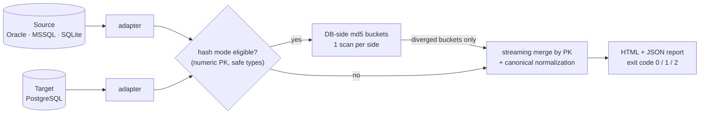

<div align="center">

# 🛡️ DBParity

### Prove your database migration didn't lose or corrupt a single row

[](https://github.com/Nik-WEBJS/DBParity/actions/workflows/ci.yml)
[](LICENSE)
[](pyproject.toml)
[](#-contributing)

**Oracle / MSSQL / SQLite → PostgreSQL** · streaming row-by-row + DB-side hash mode · client-ready HTML reports

[🇷🇺 Русская версия](README.ru.md) · [📊 Live demo report](https://nik-webjs.github.io/DBParity/demo_report.html) · [🗺️ Roadmap](ROADMAP.md) · [🐛 Report a bug](https://github.com/Nik-WEBJS/DBParity/issues)

</div>

---

Migration projects rarely fail at code conversion — they fail at **data
reconciliation**. Gartner predicts >70% of mainframe exit projects will fail;
Birmingham City Council's ERP migration grew from a **£19M estimate to £144M+**,
hinging on broken reconciliation. Plenty of tools convert schemas and SQL.
Very few *prove the data arrived intact*. DBParity does exactly that — and
gives you a report you can put on the table at project sign-off.

```console
$ dbparity compare -c config.yaml

           DBParity v0.5.0: Oracle PROD  →  PostgreSQL NEW
┏━━━━━━━━━━━┳━━━━━━┳━━━━━━┳━━━━━━━━━┳━━━━━━━┳━━━━━━━━━━━┳━━━━━━━━┳━━━━━━━┳━━━━━━━━━┓
┃ Table     ┃  Src ┃  Dst ┃ Matched ┃ Diff  ┃ Missing   ┃ Extra  ┃ Dup   ┃ Status  ┃
┡━━━━━━━━━━━╇━━━━━━╇━━━━━━╇━━━━━━━━━╇━━━━━━━╇━━━━━━━━━━━╇━━━━━━━━╇━━━━━━━╇━━━━━━━━━┩
│ customers │ 1200 │ 1199 │    1193 │     4 │         3 │      2 │     0 │ DIFF    │
│ orders    │ 5000 │ 5000 │    4997 │     3 │         0 │      0 │     0 │ DIFF    │
│ products  │  300 │  300 │     300 │     0 │         0 │      0 │     0 │ OK      │
└───────────┴──────┴──────┴─────────┴───────┴───────────┴────────┴───────┴─────────┘
╭──────────────────────────────────────────────────────────────────╮
│ NOT EQUIVALENT — 12 differences found (99.85% match)             │
╰──────────────────────────────────────────────────────────────────╯
$ echo $?
1
```

> **Status: v0.5 alpha.** Core engine (65 tests) and the PostgreSQL adapter
> are tested against a live PostgreSQL 18, runs survive network drops
> (checkpoint/resume + retries). The Oracle adapter is written but not yet
> battle-tested — **testers with real Oracle instances are very welcome!**

## ✨ Features

- 🔍 **Streaming merge by PK** — O(n) time, O(batch) memory. The table never sits in RAM, ~400K rows/s on the client path
- ⚡ **Hash mode for huge tables** — both databases compute canonical md5 aggregates per PK bucket *in a single SQL scan*; only diverged buckets are transferred. 10× less network traffic on the benchmark
- 🧠 **Migration-aware normalization** — knows the classic traps and doesn't cry wolf (see table below)
- 📋 **Schema drift detection** — missing/extra columns, logical type changes, PK mismatches, case-insensitive matching (Oracle UPPER vs PG lower)
- 📄 **Client-ready reports** — a single self-contained HTML file (dark theme, per-column drill-down, value masking for sensitive data) + machine-readable JSON
- 🤖 **CI/CD-friendly** — exit codes `0/1/2`, make the comparison a mandatory gate before switching traffic
- 🧵 **Parallel tables & live progress** — `workers: N`, connection per thread
- 🔁 **Survives network drops** — automatic retries with backoff plus checkpoint/resume: a multi-hour run continues from the last PK watermark (`--resume`), completed tables are never re-compared
- ✅ **Config validation** — `dbparity validate` catches typos and missing fields with suggestions, before any DB connection
- 📉 **Dual-write drift timeline** — incremental runs are journaled; `dbparity history` renders the drift trend down to zero, so you know when it's safe to cut over
- 🖥️ **Local web console** — `dbparity serve`: run comparisons from the browser with live progress and report links (stdlib-only, binds to localhost)

## 🪤 What it catches (and what it doesn't flag)

Real diffs — lost rows, extra rows, changed values, duplicate and NULL PKs,
schema drift — while **not** flagging things that only *look* different:

| Migration trap | Handling |
|---|---|
| Oracle `''` == `NULL` (VARCHAR2) | normalized when source dialect is Oracle |
| `1.50` vs `1.5` (NUMBER → NUMERIC) | Decimal comparison |
| float noise | configurable epsilon |
| timezones | normalize to UTC |
| Oracle `DATE` carries time / PG `date` doesn't | optional midnight truncation |
| `CHAR(n)` space padding | optional rtrim |
| Unicode composition (`ё` two ways) | NFC normalization |
| `0/1/'Y'/'N'` vs `boolean` | numeric mapping |
| BLOBs | MD5 comparison |
| timestamp precision (µs vs ns) | truncation to common precision |
| text-PK sort order differs by collation | binary collation forced on both sides (`COLLATE "C"` / `NLSSORT BINARY`) |

## ⚙️ How it works



The correctness property of hash mode: an imperfect canonical mapping can only
cause extra drill-down (slower), **never a false skip** — every hash mismatch
is re-verified by the row-level engine with full normalization.

## 🚀 Quick start

```bash
git clone https://github.com/Nik-WEBJS/DBParity && cd DBParity
pip install -e ".[postgres]"          # + [oracle] / [mssql] as needed

dbparity demo --outdir demo_out       # built-in demo with planted diffs
open demo_out/dbparity_report.html    # see what your client will see

dbparity validate -c config.yaml      # sanity-check config (no DB needed)
dbparity compare -c config.yaml       # the real thing
dbparity history -c config.yaml --html timeline.html   # dual-write drift trend
dbparity serve                        # web console at http://127.0.0.1:8765
```

### config.yaml

```yaml
source:
  type: oracle                # oracle | mssql | sqlite | postgres
  label: "Oracle PROD"
  user: app
  password: "..."
  dsn: "host:1521/ORCLPDB"
target:
  type: postgres
  label: "PostgreSQL NEW"
  dsn: "host=10.0.0.5 dbname=app user=app password=..."

tables: [customers, orders]          # default: all common tables
pk_overrides: {events: [id, ts]}     # when PK isn't declared in the DB
exclude_columns: {orders: [etl_ts]}  # service columns

rules:
  rtrim_strings: true
  float_epsilon: 1.0e-9

strategy: auto                       # auto | stream | hash
hash_leaf_rows: 20000                # PK-bucket width for hash mode
workers: 4                           # compare N tables in parallel
mask_values: false                   # true → hide values in the report

checkpoint: state.json               # enable resume after interruption
checkpoint_every_rows: 500000
retry_attempts: 3                    # fresh connections per attempt
retry_backoff_s: 2.0

report:
  html: report.html
  json: report.json
```

### Exit codes

| Code | Meaning |
|---|---|
| `0` | ✅ equivalent — safe to proceed |
| `1` | ❌ differences found |
| `2` | ⚠️ run error (connection, config) |

## 📈 Performance

`python3 bench/bench.py 1000000` — 1M rows per side, 7 columns:

| Mode | Speed | Notes |
|---|---|---|
| generic streaming | ~310K rows/s | isinstance dispatch |
| fast-path streaming | **~400K rows/s** | per-column compiled normalizers |
| hash mode (3 diffs) | **60K rows transferred instead of 600K** | the win that matters over a network |

sqlite bench implements md5 as a Python UDF, so hash-mode wall-time there
understates real gains on PostgreSQL/Oracle where hashing is native C.

## 🧪 Testing

```bash
pip install -e ".[dev,postgres]"
pytest tests/ -v                      # 65 tests

# against a live PostgreSQL:
docker compose up -d
DBPARITY_PG_DSN="host=127.0.0.1 port=5432 dbname=dbparity user=postgres password=dbparity" \
  pytest tests/test_postgres_integration.py -v

# no Docker? PGlite (real Postgres compiled to WASM):
npm install @electric-sql/pglite @electric-sql/pglite-socket
node scripts/pglite_server.mjs &
DBPARITY_PG_DSN="host=127.0.0.1 port=5433 user=postgres dbname=postgres" pytest -v
```

CI runs the suite on Python 3.10–3.12, live integration against
PostgreSQL 16, and a benchmark workflow that fails PRs on performance
regressions.

## 🗺️ Roadmap

Oracle/MSSQL hardening with community feedback → parallel-run mode for
dual-write cutovers → frozen config/report formats → v1.0.
Done so far: hash mode, checkpoint/resume, retries, binary collations,
config validation, CI benchmarks. Details: [ROADMAP.md](ROADMAP.md).

## 🤝 Contributing

The most valuable contribution right now is **a run against your real
Oracle/MSSQL → PostgreSQL migration** and an issue describing what broke.
Architecture notes live in [PLAN.md](PLAN.md) (RU). PRs welcome.

## 📄 License

[MIT](LICENSE) © 2026 Nikita Fokin

---

<div align="center">

*If DBParity saved your migration — ⭐ the repo so others can find it.*

</div>
