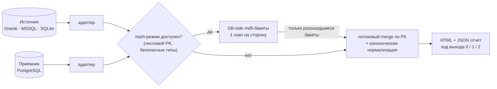

<div align="center">

# 🛡️ DBParity

### Докажите, что при миграции БД не потерялась и не исказилась ни одна строка

[](https://github.com/Nik-WEBJS/DBParity/actions/workflows/ci.yml)
[](LICENSE)
[](pyproject.toml)
[](#-вклад)

**Oracle / MSSQL / SQLite → PostgreSQL** · потоковая сверка + DB-side hash-режим · отчёты для заказчика

[🇬🇧 English version](README.md) · [📊 Живой демо-отчёт](https://nik-webjs.github.io/DBParity/demo_report.html) · [🗺️ Роадмап](ROADMAP.md) · [🐛 Сообщить о баге](https://github.com/Nik-WEBJS/DBParity/issues)

</div>

---

Миграции проваливаются не на конвертации кода, а на **сверке данных**.
Gartner прогнозирует провал >70% проектов ухода с мейнфреймов; миграция ERP
Бирмингема выросла с **£19M до £144M+** — сломалась именно сверка.
Инструментов конвертации схем много. Тех, кто *доказывает, что данные доехали
целыми*, — почти нет. DBParity делает ровно это — и выдаёт отчёт, который
интегратор кладёт заказчику на стол при сдаче проекта.

```console
$ dbparity compare -c config.yaml

           DBParity v0.5.0: Oracle PROD  →  PostgreSQL NEW
┏━━━━━━━━━━━┳━━━━━━┳━━━━━━┳━━━━━━━━━┳━━━━━━━┳━━━━━━━━━━━┳━━━━━━━━┳━━━━━━━┳━━━━━━━━━┓
┃ Таблица   ┃  Src ┃  Dst ┃ Совпало ┃ Разл. ┃ Нет в dst ┃ Лишние ┃ Дубли ┃ Статус  ┃
┡━━━━━━━━━━━╇━━━━━━╇━━━━━━╇━━━━━━━━━╇━━━━━━━╇━━━━━━━━━━━╇━━━━━━━━╇━━━━━━━╇━━━━━━━━━┩
│ customers │ 1200 │ 1199 │    1193 │     4 │         3 │      2 │     0 │ РАСХОЖД │
│ orders    │ 5000 │ 5000 │    4997 │     3 │         0 │      0 │     0 │ РАСХОЖД │
│ products  │  300 │  300 │     300 │     0 │         0 │      0 │     0 │ OK      │
└───────────┴──────┴──────┴─────────┴───────┴───────────┴────────┴───────┴─────────┘
╭──────────────────────────────────────────────────────────────────╮
│ НЕ ЭКВИВАЛЕНТНО — расхождений: 12 (совпадение 99.85%)            │
╰──────────────────────────────────────────────────────────────────╯
$ echo $?
1
```

> **Статус: v0.5 alpha.** Ядро (65 тестов) и PostgreSQL-адаптер проверены
> на живом PostgreSQL 18, сверка переживает обрывы сети (checkpoint/resume
> + ретраи). Oracle-адаптер написан, но не обкатан в бою —
> **очень нужны тестеры с реальными Oracle-инстансами!**

## ✨ Возможности

- 🔍 **Потоковый merge по PK** — O(n) по времени, O(batch) по памяти. Таблица не сидит в RAM, ~400 тыс. строк/с
- ⚡ **Hash-режим для огромных таблиц** — обе БД считают канонические md5-агрегаты по бакетам PK *за один SQL-скан*; передаются только разошедшиеся бакеты. На бенче — в 10 раз меньше трафика
- 🧠 **Нормализация «ловушек миграции»** — знает классические грабли и не поднимает ложную тревогу (таблица ниже)
- 📋 **Дрейф схемы** — потерянные/лишние колонки, смена типов, расхождение PK, регистронезависимое сопоставление (Oracle UPPER vs PG lower)
- 📄 **Отчёты для заказчика** — один самодостаточный HTML (тёмная тема, детализация по колонкам, маскирование чувствительных значений) + машиночитаемый JSON
- 🤖 **CI/CD-friendly** — коды выхода `0/1/2`: сверка как обязательный шаг перед переключением трафика
- 🧵 **Параллельность и live-прогресс** — `workers: N`, соединение на поток
- 🔁 **Переживает обрывы сети** — авторетраи с бэкоффом + checkpoint/resume: многочасовая сверка продолжается с последнего PK-watermark (`--resume`), завершённые таблицы не пересчитываются
- ✅ **Валидация конфига** — `dbparity validate` ловит опечатки и пропущенные поля с подсказками, ещё до подключения к БД
- 📉 **Таймлайн дрейфа dual-write** — инкрементальные прогоны журналируются; `dbparity history` рисует тренд дрейфа «до нуля» — видно, когда безопасно переключаться
- 🖥️ **Локальная веб-консоль** — `dbparity serve`: запуск сверок из браузера, live-прогресс, ссылки на отчёты (stdlib-only, только localhost)

## 🪤 Что ловит (и на что НЕ жалуется)

Реальные расхождения — потерянные и лишние строки, изменённые значения, дубли
и NULL в PK, дрейф схемы — и при этом **не** флагует то, что лишь *выглядит*
по-разному:

| Ловушка миграции | Обработка |
|---|---|
| Oracle `''` == `NULL` (VARCHAR2) | нормализуется при диалекте источника oracle |
| `1.50` vs `1.5` (NUMBER → NUMERIC) | сравнение через Decimal |
| шум float | настраиваемый epsilon |
| таймзоны | приведение к UTC |
| Oracle `DATE` несёт время / PG `date` — нет | опциональное усечение полуночи |
| `CHAR(n)` паддинг пробелами | опциональный rtrim |
| Юникод (`ё` двумя способами) | NFC-нормализация |
| `0/1/'Y'/'N'` vs `boolean` | числовой маппинг |
| BLOB | сравнение по MD5 |
| точность timestamp (мкс vs нс) | усечение до общей |
| порядок текстовых PK зависит от коллаций | бинарная сортировка на обеих сторонах (`COLLATE "C"` / `NLSSORT BINARY`) |

## ⚙️ Как это работает



Свойство корректности hash-режима: неидеальная канонизация может лишь вызвать
лишнюю детализацию (медленнее), но **никогда — ложный пропуск**: каждое
расхождение хэшей перепроверяется построчным движком с полной нормализацией.

## 🚀 Быстрый старт

```bash
git clone https://github.com/Nik-WEBJS/DBParity && cd DBParity
pip install -e ".[postgres]"          # + [oracle] / [mssql] по необходимости

dbparity demo --outdir demo_out       # демо со специально внесёнными расхождениями
open demo_out/dbparity_report.html    # то, что увидит ваш заказчик

dbparity validate -c config.yaml      # проверка конфига (без подключения к БД)
dbparity compare -c config.yaml       # боевая сверка
dbparity history -c config.yaml --html timeline.html   # тренд дрейфа dual-write
dbparity watch -c config.yaml --stable 3               # режим ночи переключения
dbparity serve                        # веб-консоль на http://127.0.0.1:8765
```

Пример `config.yaml` — в [английском README](README.md#configyaml)
(source/target, tables, pk_overrides, exclude_columns, rules, strategy,
workers, mask_values, report).

### Коды выхода

| Код | Значение |
|---|---|
| `0` | ✅ эквивалентно — можно переключаться |
| `1` | ❌ найдены расхождения |
| `2` | ⚠️ ошибка запуска (соединение, конфиг) |

## 📈 Производительность

`python3 bench/bench.py 1000000` — 1 млн строк на сторону, 7 колонок:

| Режим | Скорость | Примечание |
|---|---|---|
| generic streaming | ~310 тыс. строк/с | isinstance-диспетчер |
| fast-path streaming | **~400 тыс. строк/с** | пер-колоночные нормализаторы |
| hash-режим (3 диффа) | **передано 60К строк вместо 600К** | главный выигрыш — сеть |

В sqlite-бенче md5 — Python-UDF, поэтому время hash-режима там занижает
реальный выигрыш на PostgreSQL/Oracle с нативным хэшированием.

## 🧪 Тесты

```bash
pip install -e ".[dev,postgres]"
pytest tests/ -v                      # 65 тестов

# против живого PostgreSQL:
docker compose up -d
DBPARITY_PG_DSN="host=127.0.0.1 port=5432 dbname=dbparity user=postgres password=dbparity" \
  pytest tests/test_postgres_integration.py -v
```

CI гоняет сьют на Python 3.10–3.12, живую интеграцию с PostgreSQL 16
и бенчмарк-workflow, валящий PR при просадке производительности.

## 🗺️ Роадмап

Обкатка Oracle/MSSQL с сообществом → parallel-run для dual-write
переключений → заморозка форматов → v1.0.
Уже сделано: hash-режим, checkpoint/resume, ретраи, бинарные коллации,
валидация конфига, CI-бенчмарки. Подробно: [ROADMAP.md](ROADMAP.md).

## 🤝 Вклад

Самый ценный вклад сейчас — **прогон на вашей реальной миграции
Oracle/MSSQL → PostgreSQL** и issue о том, что сломалось.
Архитектура: [PLAN.md](PLAN.md). PR приветствуются.

## 📄 Лицензия

[MIT](LICENSE) © 2026 Никита Фокин

---

<div align="center">

*Если DBParity спас вашу миграцию — поставьте ⭐, чтобы его нашли другие.*

</div>
